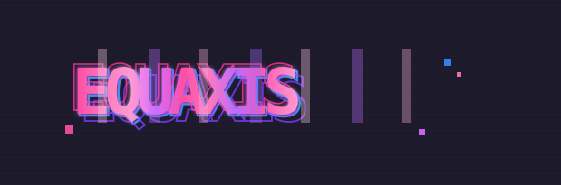

<div align="center">



# EQUAXIS · 衡枢

**被治理的 Agent 运行时 · The governed agent runtime**

> 🇨🇳 **衡枢 Equaxis** — 不重写 Pi:通过 Extension API 在 Pi 内核之上,加确定性护栏、受治理的记忆、代码知识图谱与诚实的评估闭环。
>
> 🇬🇧 **Equaxis** — doesn't rewrite [Pi](https://pi.dev/). It rides on `@earendil-works/pi-coding-agent` via the extension API, adding deterministic guardrails, governed memory, a code knowledge graph, and an honest evaluation loop.


</div>

```text
┌──────────────────────────────────────────────────────────────┐
│                        Pi Kernel 0.83                        │
│               models · sessions · TUI · tools                │
└──────────────────────────────┬───────────────────────────────┘
                               │  extension events
┌──────────────────────────────▼───────────────────────────────┐
│                      Equaxis Harness                         │
│            policy · audit · approvals · trace · validation   │
└───┬───────┬─────────┬──────────┬─────────┬────────┬──────────┘
    ▼       ▼         ▼          ▼         ▼        ▼
 Memory  CodeGraph  Subagents    Eval     Skills  GoalState  Pi-Web
 Chroma   symbols     DAG      holdout   SKILL.md   quota   dashboards
  + KG    / calls   no-replay    gates   + refine  + wake    + traces
```

## What you get

| Domain | Superpowers |
|---|---|
| 🛡️ **Governance** | Deterministic risk tiers, protected paths, HITL approvals, L1 audit trail, dual-review gates |
| 🧠 **Memory** | Memory-palace drawers, dream consolidation, knowledge-graph facts with **provenance + tamper checks**, multi-hop graph search, wiki doc index |
| 🗺️ **CodeGraph** | Symbol / import / call index from the TS compiler — callers, callees, change-impact, dead code, edit overlay |
| 🤖 **Subagents** | DAG scheduling, per-model concurrency, machine-checkable evidence, **no-replay retry** policy |
| 🎯 **Eval** | Holdout acceptance gates, capability × version delta matrix, **decision provenance** (causal chains) |
| 📚 **Skills** | SKILL.md lifecycle, negative-space routing, remote install from GitHub, refine ledger with rollback |
| 🎯 **Long tasks** | Durable goal state, token quotas, gates, leases, handoffs, scheduled auto-wake |
| 📡 **Observability** | JSONL traces, provider prefix-cache stability, live dashboards in pi-web |

## Quick Start

```powershell
git clone https://github.com/6Riemann9/equaxis-agent.git
cd equaxis-agent
npm run setup          # toolchain check + install + doctor
$env:OPENAI_API_KEY = "<your-key>"
npm run equaxis -- --approve   # first run only
```

`npm run verify:full` = TypeScript check + Node tests + memory + evaluation suites.

## Mission Control

| Command / Tool | What it does |
|---|---|
| `/equaxis` · `/equaxis-mode enforce\|audit\|off` | Governance state, switch policy mode |
| `/memory` · `recall` · `memory_graph_search` | Memory status, semantic recall, graph retrieval |
| `/equaxis-code-graph` · `code_graph_query` | Code index status, callers/impact/dead-code queries |
| `/equaxis-goal status\|wake\|schedule` | Durable goal, quota probe, Windows auto-wake |
| `/equaxis-wiki search\|graph\|ingest` | Doc index, wikilink graph, rebuild |
| `/equaxis-refine list\|record\|rollback` | Self-improvement ledger with undo |
| `/skills` · `skill_install` | Local + remote (GitHub) skills |
| `/equaxis-checkpoint restore <id>` | Rewind tool writes, second-guess free |

## Safety

- The model proposes, deterministic policy disposes — high-risk calls are blocked or routed to a human, never left to judgment.
- Secrets never reach memory; traces stay local; write/edit bodies never enter the trace stream.
- Audit records mark problems, they don't gate execution — observation stays separate from enforcement.

This is an engineering harness around Pi, **not** an OS-level sandbox.

## Docs

[Architecture](docs/ARCHITECTURE.md) · [Policy](docs/POLICY.md) · [Memory](docs/MEMORY.md) · [Evaluation](docs/EVALUATION_ARCHITECTURE.md) · [Extension Interop](docs/EXTENSION_PACKAGING.md) · [中文版](README.zh-CN.md)

## License

MIT
